Workstation Setups
==================

Git Review
----------

Git Review is a Python tool to streamline adding Gerrit to a git-based source control system.  Installation instructions for Mac, Linux, and Windows follows.

The .gitreview File
~~~~~~~~~~~~~~~~~~~

All users will need a ``.gitreview`` file to set up the location of the Gerrit server for git to use.  

Add ``.gitreview`` to the top of your repository:

.. code-block:: ruby

  [gerrit]
  host=review.local
  port=29418
  project=PROJECTNAME
  defaultbranch=master

This will add a new remote for Gerrit to your ``~/.git/config`` file.  You can check this file into your repo so that all the users will have the same configuration for Gerrit.   

Mac
~~~

1. Install ``pip`` with ``easy_install``:

.. code-block:: ruby

  sudo easy_install pip

2. Install ``git-review`` using ``pip``:

.. code-block:: ruby

  sudo pip install git-review

3. Add the ``.gitreview`` file from above.

Linux
~~~~~

Linux installation is similar to Mac OSX

1. Install ``pip`` using ``easy_install``:

.. code-block:: ruby

   sudo easy_install pip

2. Install ``git-review`` using ``pip``:

.. code-block:: ruby

   pip install git-review

3. Add the ``.gitreview`` file from above

Windows
~~~~~~~

Windows install is a bit more involved, because there is no installed version of Python on Windows systems.  If you already have Python, skip to step 3.

1. Get you some python from http://www.python.org/getit/
2. Download and install the easy installer from http://pypi.python.org/pypi/setuptools

.. code-block:: ruby

  PS C:\Users\Opscode\Downloads> C:\Python27\python.exe .\ez_setup.py
  Downloading http://pypi.python.org/packages/2.7/s/setuptools/setuptools-0.6c11-py2.7.egg
  Processing setuptools-0.6c11-py2.7.egg
  Copying setuptools-0.6c11-py2.7.egg to c:\python27\lib\site-packages
  Adding setuptools 0.6c11 to easy-install.pth file
  Installing easy_install-script.py script to C:\Python27\Scripts
  Installing easy_install.exe script to C:\Python27\Scripts
  Installing easy_install.exe.manifest script to C:\Python27\Scripts
  Installing easy_install-2.7-script.py script to C:\Python27\Scripts
  Installing easy_install-2.7.exe script to C:\Python27\Scripts
  Installing easy_install-2.7.exe.manifest script to C:\Python27\Scripts

  Installed c:\python27\lib\site-packages\setuptools-0.6c11-py2.7.egg
  Processing dependencies for setuptools==0.6c11
  Finished processing dependencies for setuptools==0.6c11

3. Use ``easy_install.exe`` to install ``pip``:

.. code-block:: ruby

  PS C:\Users\Opscode> C:\Python27\Scripts\easy_install.exe pip
  Searching for pip
  Reading http://pypi.python.org/simple/pip/
  Reading http://pip.openplans.org
  Reading http://www.pip-installer.org
  Best match: pip 1.1
  Downloading http://pypi.python.org/packages/source/p/pip/pip-1.1.tar.gz#md5=62a9f08dd5dc69d76734568a6c040508
  Processing pip-1.1.tar.gz
  Running pip-1.1\setup.py -q bdist_egg --dist-dir c:\users\opscode\appdata\local\temp\easy_install-s4zqig\pip-1.1\egg-dist-tmp-rq9b2e
  warning: no files found matching '*.html' under directory 'docs'
  warning: no previously-included files matching '*.txt' found under directory 'docs\_build'
  no previously-included directories found matching 'docs\_build\_sources'
  Adding pip 1.1 to easy-install.pth file
  Installing pip-script.py script to C:\Python27\Scripts
  Installing pip.exe script to C:\Python27\Scripts
  Installing pip.exe.manifest script to C:\Python27\Scripts
  Installing pip-2.7-script.py script to C:\Python27\Scripts
  Installing pip-2.7.exe script to C:\Python27\Scripts
  Installing pip-2.7.exe.manifest script to C:\Python27\Scripts
  
  Installed c:\python27\lib\site-packages\pip-1.1-py2.7.egg
  Processing dependencies for pip
  Finished processing dependencies for pip

4. Use ``pip`` to install ``git-review``:

.. code-block:: ruby

  PS C:\Users\Opscode> C:\Python27\Scripts\pip.exe install git-review
  Downloading/unpacking git-review
    Downloading git-review-1.17.tar.gz
    Running setup.py egg_info for package git-review

      warning: no files found matching 'requirements.txt'
  Downloading/unpacking argparse (from git-review)
    Downloading argparse-1.2.1.tar.gz (69Kb): 69Kb downloaded
    Running setup.py egg_info for package argparse

      warning: no previously-included files matching '*.pyc' found anywhere in distribution
      warning: no previously-included files matching '*.pyo' found anywhere in distribution
      warning: no previously-included files matching '*.orig' found anywhere in distribution
      warning: no previously-included files matching '*.rej' found anywhere in distribution
      no previously-included directories found matching 'doc\_build'
      no previously-included directories found matching 'env24'
      no previously-included directories found matching 'env25'
      no previously-included directories found matching 'env26'
      no previously-included directories found matching 'env27'
  Installing collected packages: git-review, argparse
    Running setup.py install for git-review

      warning: no files found matching 'requirements.txt'
    Running setup.py install for argparse

      warning: no previously-included files matching '*.pyc' found anywhere in distribution
      warning: no previously-included files matching '*.pyo' found anywhere in distribution
      warning: no previously-included files matching '*.orig' found anywhere in distribution
      warning: no previously-included files matching '*.rej' found anywhere in distribution
      no previously-included directories found matching 'doc\_build'
      no previously-included directories found matching 'env24'
      no previously-included directories found matching 'env25'
      no previously-included directories found matching 'env26'
      no previously-included directories found matching 'env27'
  Successfully installed git-review argparse
  Cleaning up...

5. You'll want to make sure that ``C:\Python2N`` and ``C:\Python2N\Scripts`` are both in your system ``%PATH%``. You'll want to make sure that your ``%PATH%`` is re-read, probably by restarting your shell.  You can then add the ``.gitreview`` file and start using ``git review``.

Eclipse IDE
~~~~~~~~~~~

In Eclipse, Gerrit will use the ``EGit`` implementation of the ``git`` user tools.

1. In Eclipse, click 'Help -> Install New Software'
2. Select the appropriate repository for your version of Eclipse, and search for ``git`` in the search box:

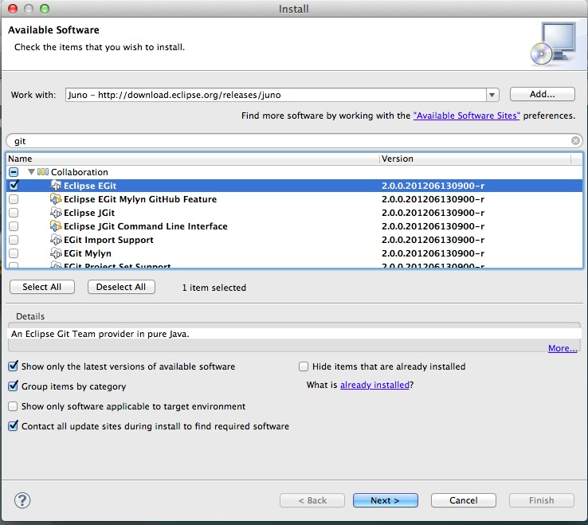

3. Click 'Next' and 'Finish'.  EGit will install and Eclipse will restart.

Adding github projects to eclipse

Once the project has been initialized on github
Import the project: click "File -> Import"

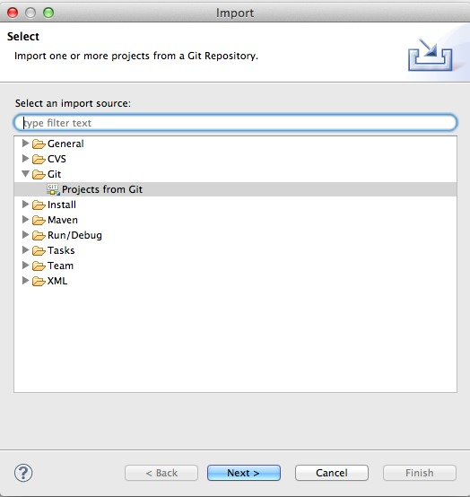

Choose "Git" and "Projects from Git".  Click "Next".  

This is the source repository, and you'll be pulling updates from the github repository, so don't choose "Gerrit" at this step, choose "URI":

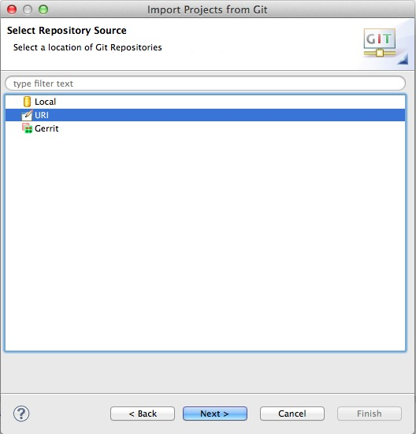

Enter the information about your upstream github repository and click "Next":

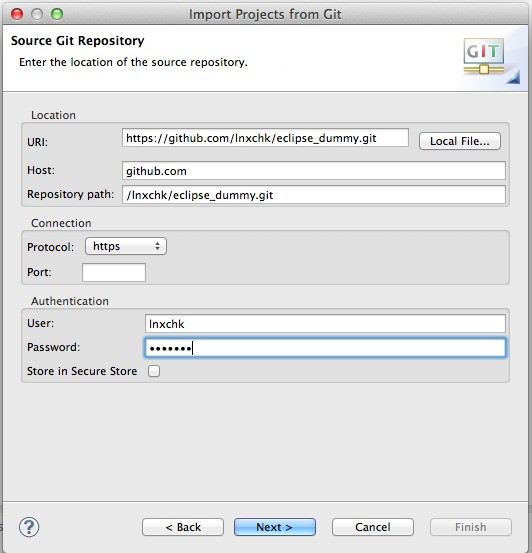

If there are multiple branches in the repo already, you'll likely want all of them.  At the very least, you will want the ``master`` branch:

.. image:: ../images/eclipse_git_branches.jpg
   :alt: Select necessary branches

Configure the local destination.  This is the location on your workstataion for your local copy of the repo:

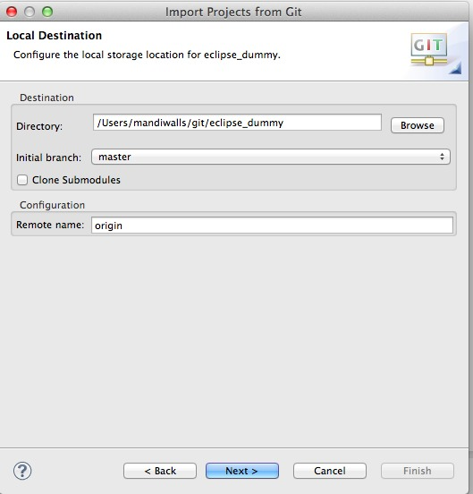

You can use whatever "Remote name" you want to for this repo.

Select the type of project to import. If the ``.project`` files are already in the repo, Eclipse will attempt to use them. If not, you can choose what project framework to use.

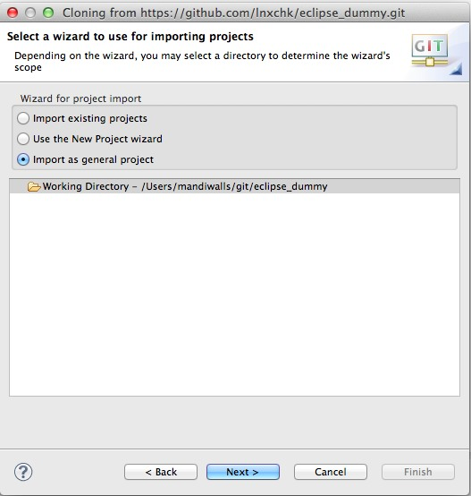

Finally, if you want to change the working project name to be something other than the project's name in the repository, you can change that. Otherwise, just click "Finish":

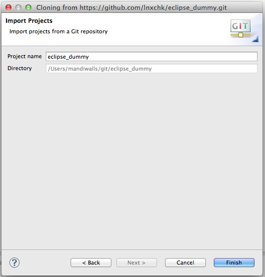

Now add the Gerrit remote for push.  

Add the "Repositories" view to your window layout. Click on "Window -> Show View -> Other":

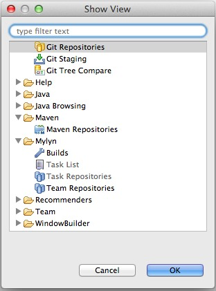

Choose "Git Repositories" and click "OK". You'll now have a "Git Repositories" module in your project window:

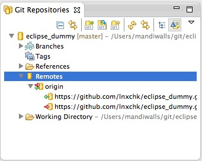

Now you can add a new Remote to your configuration.  In the "Git Repositories" window, expand the project name, and right-click on the "Remotes" category.  Choose "Create Remote".  Name the new Remote "review" or similar and configure it for Push:

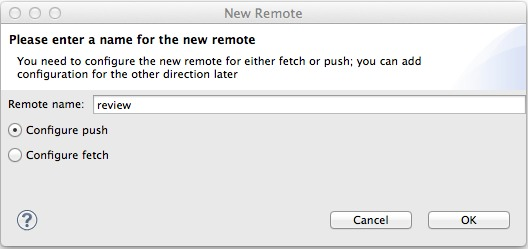

Add the URI for the Gerrit remote.  You'll need to include the port number, *29418*, and use the username you configured with your ssh keys earlier.

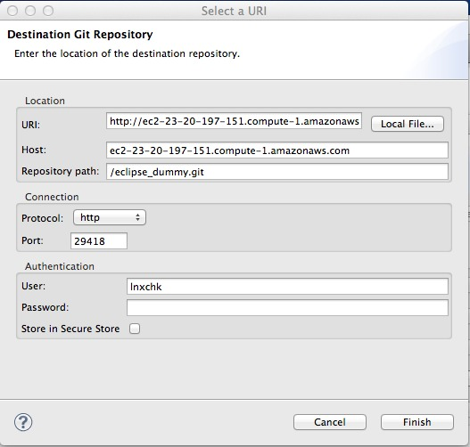

Save the new remote.  Now right click on the "review" remote in the "Git Repositories" module, and select "Gerrit Configuration".

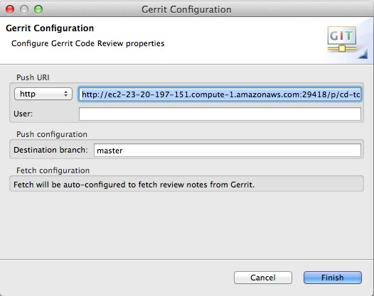

Add the refspecs for the push job. In the Configuration panel, click "Advanced...".  If your config is talking to the Gerrit server correctly, it should ask you to add the key, then give you a dialog panel:

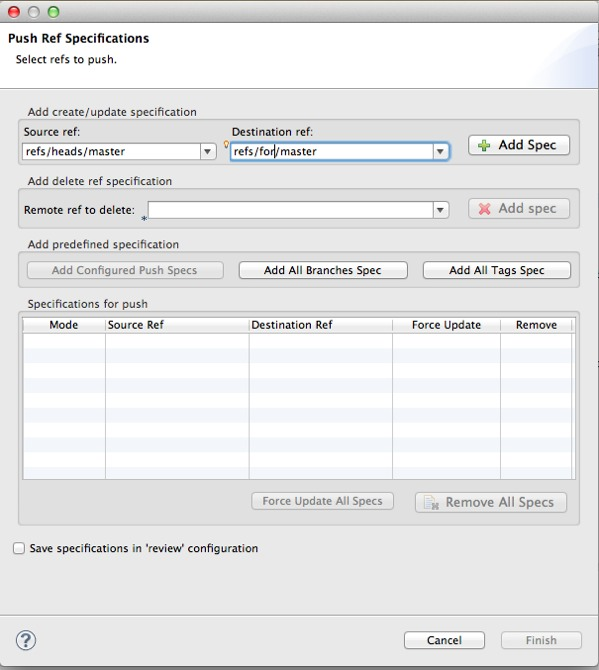

Add a "Source ref" for "refs/heads/master" with a "Destination ref" of "refs/for/master" for Gerrit.  Click "Add Spec" and "Finish".

Click "Dry-Run" and verify that you don't receive any errors:

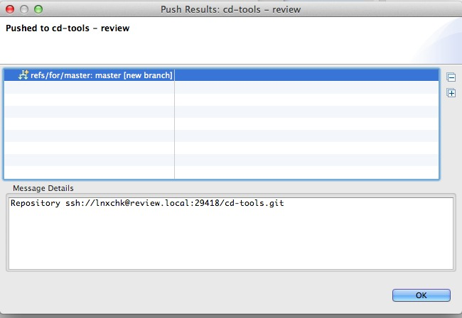

Click "Save".  You are now ready to write, commit, and push code for review!

*NOTE*

The EGit plugin does not at this time support interactive rebase, which is necessary for re-applying a new commit to the same review.  If you are using eclipse and need to use ``git rebase -i HEAD~N`` or ``git commit --amend``, you'll need to do it from your local git copy on disk.
